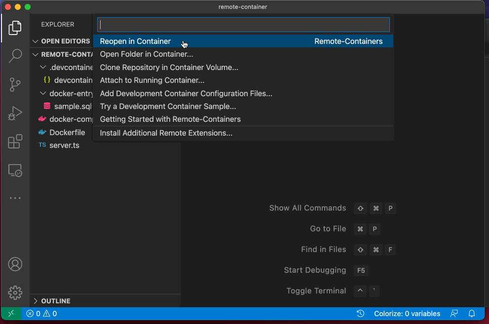
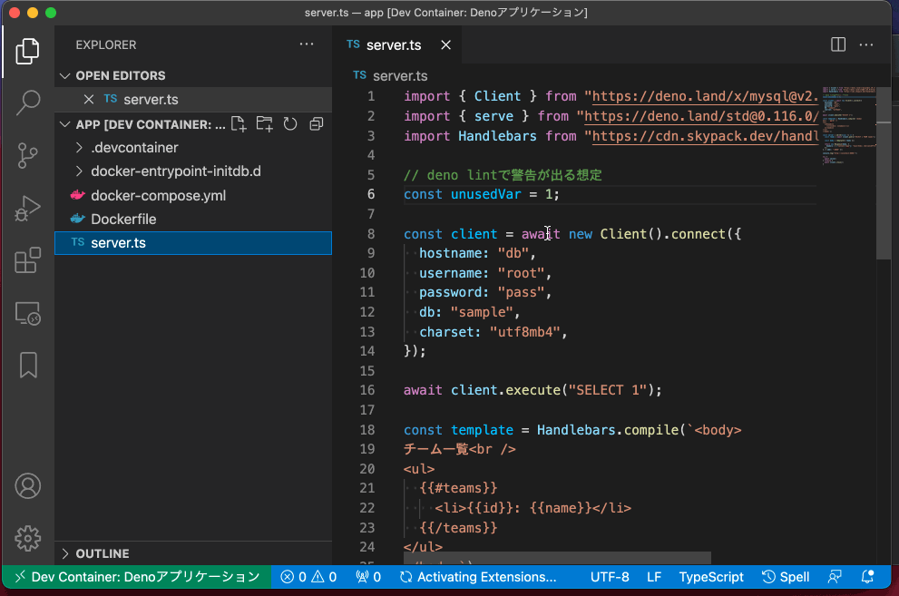

# サンプルDenoソースコード

DenoでDBアクセスをするWebサーバーのサンプル

## Docker Composeで起動する方法

```shell
docker-compose up -d

docker-compose exec app bash
deno run --allow-net server.ts
# or
# docker-compose exec app deno run --allow-net server.ts

# Webブラウザで開く
open http://localhost:8000/
```

Webブラウザを開くと下記のように表示される


## Visual Studio Code Remote - Containers を利用する方法

1. 左下の緑色の領域をクリック

2. 起動するとDeno拡張機能が有効になっている。


詳しくはこちらの記事を参照

https://toranoana-lab.hatenablog.com/entry/2021/12/07/113005
